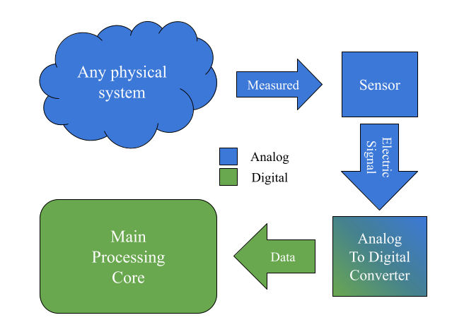

.. Delta-Sigma-Modulator documentation master file, created by
   sphinx-quickstart on Wed Oct 19 13:23:50 2022.
   You can adapt this file completely to your liking, but it should at least
   contain the root `toctree` directive.

Welcome to Delta-Sigma-Modulator's documentation!
#################################################

.. toctree::
   :maxdepth: 2
   :caption: Table of Contents:
   
   sub_files/human_team
   sub_files/marketing
   sub_files/theoretical_deep
   sub_files/problem
   

Motivation
**********
Nowadays, there is a growing demand for IoT devices to strengthen this Smart City concept, 
connecting all the systems in a given environment. This is great for users who have more and
more options to solve specific problems comfortably, but it is a headache for the design engineers
of these systems since these systems are full of limitations to consider. One of the main
limitations is that energy consumption is becoming increasingly critical because these are 
battery-powered systems, they are systems that work with solar energy or simply because a 
network of systems that is more efficient in energy consumption is desired.

Within these IoT devices, there is a wide variety of applications that require 
digital processing, using the data obtained from the environment, a couple of those 
could be telecommunications, instrumentation, among others. In practice, the data
obtained by the environment is purely analog, so data conversion systems, to make this data 
usable by the processing core (analog-to-digital converter; ADC) are needed. Figure 1 shows a 
diagram of a basic sensing system where analog systems are shown in blue and digital systems in 
green. Here a physical variable or state is measured by a sensor, creating an electric analog 
signal who is converted into digital data by the ADC and send to the processing unit to decide
what to do whit this information. Let's think this "Any physical system" could be your room and
you want to control the temperature, so you measure the temperature and the processing core can
decide if the air-conditioning should be increased, decreased, turn on or just turn off. 
The main point is that you measured an analog variable like temperature, humidity, pressure, 
Oxygen level, or whatever you need to know about and this analog information is converted into 
digital through an ADC, this is why almost any kind of IoT system requires a converter.

   
   Figure 1. Diagram of a basic sensing system.
..   :align: left
..   :target: IMG/SensingBlockDiagram.png
..   :height: 100
..   :width: 200
 Diagram of a basic sensing system.
 
Here we can just follow a logical thought that is if any IoT 
system needs to care about its energy consumption and any IoT
system requires an ADC so the ADC design for IoT needs to care 
about energy consumption. The objective of this project is to 
reduce the power consumption of a Delta-Sigma ADC, more 
exclusively to reduce the consumption of the modulator of this 
system, making it a more solid alternative for these current 
IoT systems. To this end, this project is limited, for economic 
reasons, to carry out the design study on models and 
simulations, without manufacturing the final result in Silicon.

However, this will lay the groundwork so that in the future, 
this block can be used in a larger project that is a candidate 
for manufacturing and physical testing, thus noting a possible 
future impact on students requiring low power in their projects 
related to the area and a delta-sigma modulation within an ADC.

In addition to contributing with this design to the block 
libraries of the OnChip research group of which we are part 
as collaborators. With this providing one more block to the 
SoCs designed in Colombia.
In this way, the OnChip group is identified as the main 
interested party and as a client of the solution provided 
by this project.

The market for the development of IoT systems in Colombia has 
not been exploited, being a developing country, the number of 
companies or entities focused on the development and 
manufacture of the intellectual property of these systems is 
very limited, and for this reason, entering a market around 
these applications for smart or autonomous homes or buildings
is very difficult due to the high costs of the design and 
manufacturing processes that these systems must go through. 
However, in developed countries such as the USA, Germany, 
Austria, England, Russia, among others, there is a growing 
market for the middle class, which allows them to enjoy 
intelligent systems in the comfort of their homes, and projects 
like this one can be valuable for those markets. Nowadays, 
discussions about SoC in Colombia are just academic, and there 
are some universities like the Universidad Industrial de 
Santander who are trying to improve in this field.

To introduce this project, we would like to introduce some 
basic concepts about ADCs as systems, to expand on these 
concepts press the **theoretical deepening** button, or if you 
have a good idea about ADCs, let us introduce you to the 
problem we want to address in **the problem** button.

Indices and tables
==================
* :ref:`Theoretical`
* :ref:`Problem`
* :ref:`genindex`
* :ref:`search`
